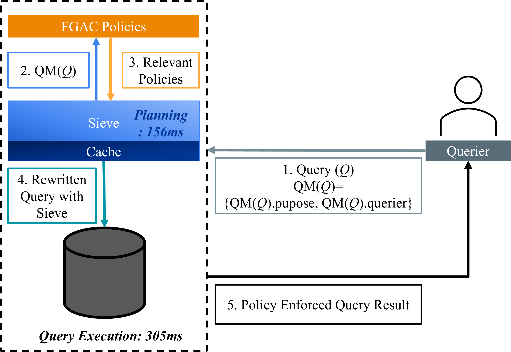

# Sieve 


SIEVE is a general purpose middleware to support access control in DBMS that enables them to scale query processing with very large number of access control policies. Full version of the paper can be seen at [arXiv](https://arxiv.org/abs/2004.07498). 

## Table of Contents
- [Sieve Architecture Overview](#sieve-architecture-overview)
- [Setup](#setup)
- [Usage](#usage)
- [Directory Tree](#directory-tree)

## Sieve Architecture Overview

<p align="center">
   
</p>

Sieve introduces a lightweight planning phase to enforce fine-grained access control more efficiently. As shown in the figure, the process begins when a querier submits a query (1), which includes metadata such as the purpose and querier identity. Sieve extracts this metadata (2) and uses it to retrieve only the relevant policies from the full set of FGAC policies (3). These selected policies are then used to rewrite the query (4), ensuring that access control is enforced without evaluating irrelevant policies. The rewritten query is executed on the underlying database, and the final, policy-enforced result is returned to the querier (5).

To improve performance, Sieve also integrates a cache that stores previously computed guarded expressions. If a matching entry exists in the cache, planning time is significantly reduced. In the example shown, the planning phase completes in just 156ms. This architecture reduces redundant policy checks and accelerates both query rewriting and execution, making Sieve efficient and responsive across varied workloads.

## Setup

1. Download [MySQL](https://dev.mysql.com/downloads/installer/) or [PostgreSQL](https://www.enterprisedb.com/downloads/postgres-postgresql-downloads)
2. Create a user "sieve" and grant privileges of DBA role.
3. Create a Schema called "sieve".
4. Populate the schema with the data that can be found inside the directory (data/wifi_dataset.tar.xz for MySQL and data/mall_dataset.tar.xz for PostgreSQL)
   1. Extracted files are sql dump files.
   2. Import the table definition (wifi_defn.sql/ mall_defn.sql)
   3. Import the data (wifi_data.sql/ mall_data.sql)
5. Update the sample.properties file found inside the src/main/resources/credential.sample directory with the DBMS properties

## Usage

1. Install any java code editor (maven extension required) or [IntelliJ](https://www.jetbrains.com/idea/download/?section=windows) (comes with inbuilt maven requirements)
2. Open the sieve project.
3. Set the dbms and table_name options in resources/config/general.properties
4. Set true for the experiments that you wish to run (Options: Query Performance, Policy Scale up. Caching)
5. Configure caching and workload properties in:
   1. Set cache size and window size options in resources/config/execution/caching.properties 
   2. Set interleaving pattern of policy and query operations, select the workload scenario, and choose the experiment to run in resources/config/execution/workload.properties 
6. Compile the code
```
mvn clean install

```
7. Execute it with
```
mvn exec:java 
```
## Directory Tree
```
:file_folder: Sieve-root/
├── :file_folder: data
│   └── :page_facing_up: mall_dataset # Mall Dataset
│   └── :page_facing_up: wifi_dataset # Presence Dataset
├── :file_folder: histogram # Underlying Statistics
├── :file_folder: images # Images used in ReadMe
├── :file_folder: result # Stores result in .csv and .txt
├── :file_folder: script # Contains reusable lookup scripts written in Python and SQL
├── :file_folder: src\main # Source Code
│   └── :file_folder: java/edu/uci/ics/tippers # Contails java code
│       └── :file_folder: caching
│       └── :file_folder: common
│       └── :file_folder: dbms
│       └── :file_folder: execution
│           └── :page_facing_up: Sieve # Main class to launch the code
│       └── :file_folder: fileop
│       └── :file_folder: generation
│       └── :file_folder: model
│       └── :file_folder: persistor
│   └── :file_folder: resources # Contains .properties files

```

:file_folder:
:page_facing_up:


## License
[Apache 2.0](https://choosealicense.com/licenses/apache-2.0/)

